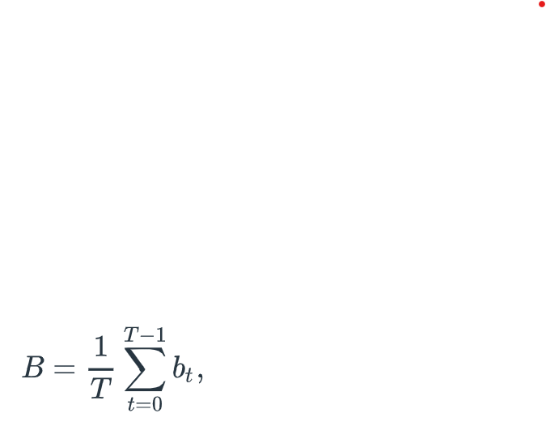
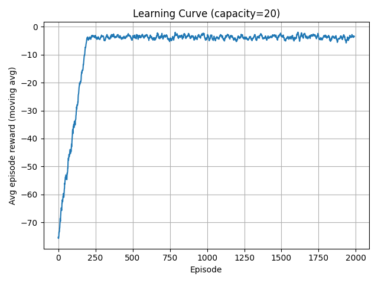
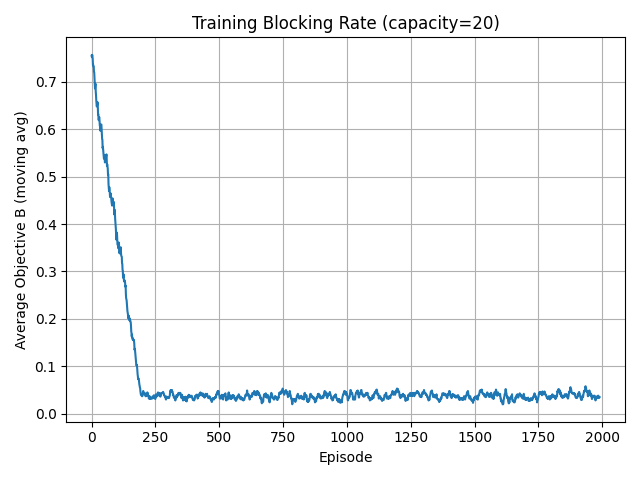
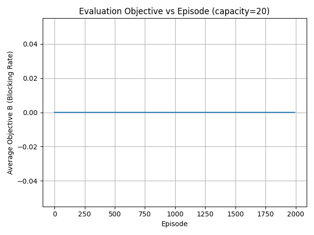
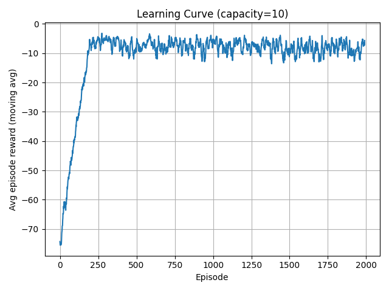
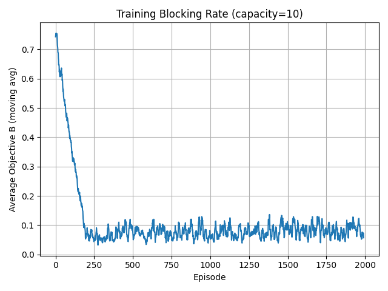
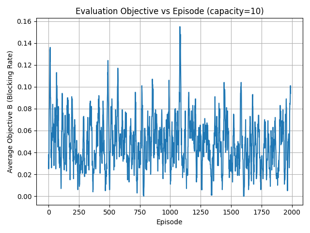

# Routing and Spectrum Allocation with DQN  
CS 258 — Final Project (Fall 2025)

---

## How to Execute

### Training  
Run the DQN agent for each capacity setting:

```bash
cd src
python dqn_runner.py --capacity 20
python dqn_runner.py --capacity 10
```

Each run trains an agent using `data/train/`, saves a model under `models/`, and generates training plots under `plots/`.

### Evaluation  
(Will be completed once evaluation.py is finalized.)

After training, evaluation will be run using:

```bash
python evaluation.py --capacity 20 --model_path ../models/dqn_capacity_20.zip --episodes 2000
python evaluation.py --capacity 10 --model_path ../models/dqn_capacity_10.zip --episodes 2000
```

This evaluates the trained models on `data/eval` using deterministic predictions.

---

## Environment

The environment simulates the Routing and Spectrum Allocation (RSA) problem.  
Each **episode** corresponds to **one request file (~100 requests)**, as required:

> One simulation (episode) corresponds to one request file with 100 requests.

Each step (time slot) processes exactly one request.

---

## State Representation & Transitions

### Observation Vector (35 features)

- **12 link utilizations:** (# wavelengths used) / capacity  
- **12 free wavelength ratios:** (# free wavelengths) / capacity  
- **3 request features:** normalized source, destination, holding time  
- **8 path availability flags:** 1 if a path has an available wavelength, else 0  

### State Transitions (per request)

1. Release expired lightpaths.  
2. Attempt routing + first-fit wavelength allocation while enforcing:  
   - wavelength continuity  
   - capacity limits  
   - uniqueness of wavelength on each link  
3. Update link occupancy and active lightpaths.

Link state is maintained in `LinkState` objects that store capacity, utilization, wavelength occupancy, and expiration times.

---

## Action Representation

The agent selects one of 8 discrete routing actions:

| Actions | Meaning |
|--------|---------|
| 0–1 | Paths P1–P2 for requests 0 → 3 |
| 2–3 | Paths P3–P4 for 0 → 4 |
| 4–5 | Paths P5–P6 for 7 → 3 |
| 6–7 | Paths P7–P8 for 7 → 4 |

Invalid actions for a given (src, dst) automatically result in failed allocation.

---

## Reward Function

- **0** → successful lightpath allocation  
- **–1** → request blocked  

Additionally, the environment exposes:

```python
info["blocked"] = 0 or 1
```

This allows computing the **episodic blocking rate**, the main optimization objective:




---

## Additional Constraints

- Wavelength continuity  
- Capacity constraint  
- Wavelength conflict avoidance  
- First-fit spectrum allocation  
- Episodes fixed to one request file (~100 steps)  

---

## Training Setup

### Algorithm
Deep Q‑Network (DQN) from Stable‑Baselines3.

### Hyperparameters (initial configuration)

```python
learning_rate = 1e-3
batch_size = 64
buffer_size = 50000
learning_starts = 1000
gamma = 0.99
target_update_interval = 1000
exploration_fraction = 0.2
exploration_final_eps = 0.05
```

Training runs use **200,000 timesteps per capacity**, giving ~2000 episodes (each ≈100 requests).

### Hyperparameter Tuning  
(Section reserved for final report after evaluation and performance review.)

---

## Results 

### Capacity = 20 


- Learning curve (avg reward vs episode)
- Early training is enough to achieve high average reward value (lower reward numbers indicates better selection) in part because of high capacity.
- Good reward values are consistent at a certain high reward value and therefore flattens the curve at the top.



- Training blocking rate (avg B vs episode)
- Early training is enough to achieve a low average blocking rate in part because of high capacity.
- After average blocking significantly drops off, the curve stabilizes at a tight range around 5%.


  
- Evaluation blocking rate (avg B vs episode)
- At capacity = 20, blocking is effectively zero after sufficient training and in an environment with sufficient resources/provisioning.
- This results in a flat evaluation blocking rate curve at 0 after initial exploration.

### Capacity = 10  


- Learning curve (avg reward vs episode)
- Similar to capacity = 20, early training is enough to achieve high overall average reward value.
- However, due to lower capacity, the reward values fluctuate slightly more as the agent encounters more blockage on average.



- Training blocking rate (avg B vs episode)
- Also similar to capacity = 20, early training is enough to achieve a low average blocking rate.
- And likewise, the curve stabilizes after initial training, but at a more flucuating range around 7-12% due to lower capacity.


  
- Evaluation blocking rate (avg B vs episode)  
- At capacity = 10, blocking is much more significant than capacity = 20 due to lower resources/provisioning.
- Therefore, the graph is more varied and chaotic than that of capacity = 20, which indicates contention and non-zero average blocking rate.
 

---

## Files Included

- `rsaenv.py` — custom RSA environment  
- `nwutil.py` — graph and request structures  
- `dqn_runner.py` — training pipeline  
- `evaluation.py` — evaluation pipeline
- `models/` — trained agents (saved)  
- `plots/` — generated figures
- `data/train`, `data/eval` — datasets

---

## Notes  
left space for:  
- hyperparameter tuning summary  
- evaluation results  
- final observations and discussion  

